## 产品概述

为 gpt-researcher 增加一个**本地轻量文献存储库**：用户上传的文献（PDF/DOCX/MD/HTML/XLSX 等）会被自动解析、切块、向量化并打上"研究方向"标签，持久化到磁盘文件而不引入任何向量数据库服务。当 `report_source` 选择"我的文档（local）"或"混合（hybrid）"时，研究流程改为从该文献库做向量检索，而不是每次全量读盘。

## 核心功能

- **文献上传与持久化**：复用现有 `/upload/` 接口，文件落到 `DOC_PATH`（`./my-docs`）；同时为新文件做增量切块 + 向量化，写入本地 FAISS 索引文件（`my-docs/.index/index.faiss` + `index.pkl`）
- **自动打标（研究方向）**：上传后用 LLM 对文献做一次解析，输出 `primary_field`（受控词表，单选）、`subfields`（受控词表，多选）、`keywords`（自由关键词 5-10 个）、`summary`（≤200 字摘要）；元信息汇总到 `my-docs/.index/manifest.json`，并把标签写入每个 chunk 的 metadata
- **本地/混合模式向量检索**：`local` / `hybrid` 流程改为从 FAISS 加载索引并做 `similarity_search` 召回 top-k chunk（替代当前的全量读盘 + 重新分块），混合模式再叠加 web 搜索结果
- **文献管理 API**：扩展 `/files/`（GET）返回每个文件的标签、摘要、上传时间、chunk 数；扩展 `/files/{filename}`（DELETE）同步从 FAISS 中清除该文件的向量；新增 `/api/library/tags`（GET）返回当前所有可用标签及其计数，新增 `/api/library/reindex`（POST）支持手工重建
- **前端展示与筛选**：在 Next.js 文献列表页为每条文献渲染标签 chip + 摘要 tooltip，顶部增加按 `primary_field` / 关键词的多选筛选条；筛选只过滤展示，不影响检索（检索时所有文献都参与召回）

## 视觉效果

文献卡片样式：文件名（粗体）+ 上传时间（次要色）+ primary_field 主标签 chip（高亮配色）+ subfields/keywords 次要 chip（灰底）+ 一句摘要；顶部筛选栏支持多选 chip 切换，命中状态用主题色描边。

## 技术栈

- **后端**：沿用项目现有 Python 3 + FastAPI；向量化用 `langchain-community` 的 `FAISS`（项目已通过 `langchain_community.vectorstores` 引入相关生态）；embedding 复用 `gpt_researcher/memory/embeddings.py` 的 `Memory` 工厂（已支持 `ollama` provider）；LLM 打标复用项目 `gpt_researcher/utils/llm.create_chat_completion`（走 `.env` 里的 `FAST_LLM=deepseek:deepseek-chat`）
- **存储**：纯文件，无数据库服务
- `my-docs/<原文件>`：原始文献（已存在）
- `my-docs/.index/index.faiss` + `index.pkl`：FAISS 序列化索引
- `my-docs/.index/manifest.json`：每篇文献的元信息（含标签、hash、chunk 数、上传时间）
- `my-docs/.index/taxonomy.json`：受控词表（默认随包提供，用户可改）
- **前端**：沿用 `frontend/nextjs/`（Next.js + TypeScript），在已有文献组件上扩展，不引入新组件库

## 实现思路

1. **新增"文献库管理器" `LibraryManager`** 作为单一入口，封装 FAISS 加载/保存/增量 merge/按 source 删除、manifest 读写、打标调用、查询 API。所有上传/删除/检索都通过它，避免散落在多处
2. **上传时打标 + 索引一次完成**：`handle_file_upload` 落盘后立刻调用 `LibraryManager.add_document(file_path)`，内部串行执行：解析 → 切块 → embedding → merge 进 FAISS → 调 LLM 打标 → 写 manifest → 原子保存索引。打标失败不阻塞索引（标签留空 + warning 日志）
3. **检索路径改造**：`gpt_researcher/skills/researcher.py` 的 `Local` / `Hybrid` 分支改为：

- 若存在 FAISS 索引 → 用它做 `asimilarity_search(query, k=cfg.similarity_top_k)`，把召回的 chunk 拼成 `document_data` 喂给 `_get_context_by_web_search`
- 若索引不存在（首次/旧目录）→ 退回原来的全量 `DocumentLoader.load()` 路径，保证向后兼容

4. **删除路径**：FAISS 不支持按 metadata 直接删除——量级小（你预期不多），策略是"标记 manifest 中该文件 deleted → 重建索引（只对未删除的文件 embedding）"，重建走后台异步避免阻塞 HTTP；如果文件总数 < 50，直接同步重建也可接受
5. **打标 schema 严控**：prompt 里硬性要求返回 JSON，调用侧用 `json.loads` + 字段白名单校验，`primary_field` 必须落在 `taxonomy.json` 的 fields 集合内（不在则 fallback 到 `Other`），`keywords` 长度 ≤ 16 字符、数量 ≤ 10，防止脏数据污染索引

## 实现注意事项

- **性能**：单文献向量化是 IO+计算热点。使用 `RecursiveCharacterTextSplitter(chunk_size=1000, chunk_overlap=200)` 与现有 `VectorStoreWrapper` 一致；embedding 走 ollama 本地，无网络成本；打标只取前 `MAX_CLASSIFY_CHARS=8000` 字符，避免大文献塞爆 token。FAISS 使用 `IndexFlatL2`（默认）即可，几百篇下 `similarity_search` 毫秒级
- **原子写**：`manifest.json` 与 FAISS 文件用"先写 `*.tmp` 再 `os.replace`"模式，避免上传中途崩溃留下半文件；并发写用 `asyncio.Lock`（进程内单例）
- **日志**：复用项目 `logging.getLogger(__name__)`，关键节点（上传开始/embedding 完成/打标完成/索引保存）输出 INFO，错误 ERROR；不打印文献正文，避免日志泄漏与膨胀
- **安全**：
- 文件名继续走 `os.path.basename` + 现有 `sanitize_filename` 思路防穿越
- LLM 返回内容**只取已知字段**，未知字段丢弃，防 prompt 注入污染 metadata
- manifest/taxonomy 用 `json.load`（安全），禁用 pickle 自由读取（FAISS 自己的 pkl 由 LangChain 控制，`allow_dangerous_deserialization=True` 仅在加载**自己写的**索引时使用，配合路径白名单）
- **向后兼容**：`vector_store_filter`、`langchain_vectorstore` 等其他 `report_source` 分支不动；未启用 ollama / 没有 embedding 配置时自动 fallback 到旧的全量读盘路径，并日志告警

## 架构设计

```mermaid
flowchart TB
    subgraph Upload[上传链路]
        A[POST /upload/] --> B[handle_file_upload]
        B --> C[落盘 my-docs/]
        C --> D[LibraryManager.add_document]
        D --> D1[DocumentLoader 解析]
        D1 --> D2[Splitter 切块]
        D2 --> D3[ollama embedding]
        D3 --> D4[FAISS merge_from]
        D2 --> D5[LLM 打标 deepseek-chat]
        D4 --> D6[原子保存索引+manifest]
        D5 --> D6
    end
    subgraph Research[检索链路]
        R1[ResearchConductor.local/hybrid] --> R2{FAISS 索引存在?}
        R2 -- 是 --> R3[LibraryManager.search top-k]
        R2 -- 否 --> R4[旧路径 DocumentLoader 全量]
        R3 --> R5[拼为 document_data]
        R4 --> R5
        R5 --> R6[_get_context_by_web_search]
    end
    subgraph Frontend[前端]
        F1[文献列表] --> F2[GET /files/ 含标签]
        F2 --> F3[渲染标签 chip + 摘要]
        F3 --> F4[按 primary_field/关键词筛选]
    end
```



## 目录结构

```
gpt-researcher-main/
├── gpt_researcher/
│   └── document_library/                              # [NEW] 文献库模块（独立子包，避免污染现有 document/）
│       ├── __init__.py                                # [NEW] 导出 LibraryManager
│       ├── library_manager.py                         # [NEW] 核心：单例管理 FAISS 索引、manifest、增删查；提供 add_document(path)、remove_document(filename)、search(query, k, filter)、list_documents()、reindex_all()；内部锁防并发；FAISS 用 langchain_community.vectorstores.FAISS，embedding 复用 gpt_researcher.memory.Memory；保存/加载用原子写
│       ├── classifier.py                              # [NEW] 打标器：classify_document(text, taxonomy) -> {primary_field, subfields, keywords, summary}；调用 utils.llm.create_chat_completion 走 FAST_LLM；prompt 强制 JSON 输出；返回值做白名单+长度校验，失败返回空标签 + warning
│       ├── manifest_store.py                          # [NEW] manifest.json 读写：load()、upsert(entry)、remove(filename)、list()；entry 字段：filename, sha256, uploaded_at, chunks, primary_field, subfields, keywords, summary, status；原子写
│       ├── taxonomy.py                                # [NEW] 受控词表加载：load_taxonomy(doc_path) 优先读 my-docs/.index/taxonomy.json，否则 fallback 到内置默认词表（人工智能/机器学习/NLP/CV/医学/材料/经济金融/物理/化学/生物/教育/法律/历史/Other 等中文一级 + 二级）
│       └── default_taxonomy.json                      # [NEW] 默认中文研究方向受控词表
├── gpt_researcher/skills/
│   └── researcher.py                                  # [MODIFY] 第 152-170 行 Local/Hybrid 分支：优先调用 LibraryManager.search 拿 top-k chunk 作为 document_data；无索引或异常时降级到原 DocumentLoader 全量路径；保持其它分支不变
├── gpt_researcher/config/variables/default.py         # [MODIFY] 新增配置项：similarity_top_k=8、library_enabled=True、classify_on_upload=True；保持原有键不动
├── backend/server/
│   ├── server_utils.py                                # [MODIFY] handle_file_upload：落盘后 await LibraryManager.add_document(file_path)，返回值附带新生成的标签；handle_file_deletion：删除文件后 await LibraryManager.remove_document(filename)；新增 list_files_with_metadata() 供 /files/ 调用
│   └── app.py                                         # [MODIFY] /files/ 改为返回 [{filename, primary_field, subfields, keywords, summary, uploaded_at, chunks}]；新增 GET /api/library/tags 聚合统计；新增 POST /api/library/reindex 触发全量重建（后台任务）；新增 GET /api/library/manifest/{filename} 返回单文献详情
├── frontend/nextjs/
│   ├── components/Settings/                           # [MODIFY] 文献列表组件（在该目录下定位现有 FileUpload/Files 类组件后扩展）：每条文件渲染主标签 chip（高亮）+ 次要 chip（灰）+ 摘要 tooltip；顶部加多选筛选条（标签来源 /api/library/tags）；筛选仅前端过滤展示
│   ├── types/data.ts                                  # [MODIFY] 在已有文件类型上扩展 LibraryFile：{filename, primaryField, subfields[], keywords[], summary, uploadedAt, chunks}
│   └── helpers/getHost.ts                             # [REFERENCE] 沿用现有 host 拼接方式调用新接口，无需改动
├── tests/
│   ├── test_library_manager.py                        # [NEW] 单测：增量 add → search 命中、remove 后 search 不命中、原子写中断恢复、降级路径触发
│   └── test_classifier.py                             # [NEW] 单测：合法 JSON / 非法 JSON / 不在词表的 primary_field 全部走 fallback
└── my-docs/                                           # 运行时目录（不入库，已有）
    └── .index/                                        # [运行时] 由 LibraryManager 自动创建
        ├── index.faiss
        ├── index.pkl
        ├── manifest.json
        └── taxonomy.json                              # 首次启动时从 default_taxonomy.json 拷贝，用户可手工编辑
```

## 关键接口（仅 LibraryManager 对外契约，其他用文字描述足够）

```python
class LibraryManager:
    def __init__(self, doc_path: str, cfg: Config): ...
    async def add_document(self, file_path: str) -> dict: ...
        # 返回 manifest entry，含标签
    async def remove_document(self, filename: str) -> bool: ...
    async def search(self, query: str, k: int = 8,
                     filter: dict | None = None) -> list[dict]: ...
        # 返回 [{raw_content, url, metadata}]，与现有 document_data 结构一致
    def list_documents(self) -> list[dict]: ...
    def aggregate_tags(self) -> dict: ...   # {primary_field: count, keywords: {kw: count}}
    async def reindex_all(self) -> None: ...
```

## 设计风格

延续 gpt-researcher 现有 Next.js 前端的简洁现代风格，本次只在"文献库"区域做增强，不重构整体页面。卡片化展示 + 标签 chip + 顶部筛选条的组合，配合柔和阴影与 hover 微动效，让用户第一眼能看到"哪些文献是哪个领域的"。

## 文献列表页（增强）

- **顶部筛选条 Block**：横向标签 chip 多选（数据来自 `/api/library/tags`），每个 chip 显示"领域名 · 数量"；选中态用主色描边 + 浅色背景；右侧"清空筛选"链接按钮
- **文献卡片 Block**：左侧文件类型图标（PDF/DOCX/MD），中间纵向：文件名（16px / 600）→ 一行摘要（13px / 灰）→ 标签行（primary_field 主 chip 高亮 + 最多 4 个 subfields/keywords 次 chip），右侧元信息（上传时间 + chunks 数）+ 删除按钮（hover 红色）
- **空状态 Block**：未上传时显示拖拽上传引导插图 + "支持 PDF / DOCX / MD / HTML / XLSX"提示
- **上传中状态 Block**：顶部进度条 + "正在解析与打标…"文案，打标完成后卡片淡入显示新标签

## 上传弹窗（轻调）

- 上传完成后增加 1.5s 的"标签生成中"loading 占位，完成后展示 LLM 返回的 primary_field + 摘要让用户快速核对

## Agent Extensions

### SubAgent

- **code-explorer**
- Purpose: 在前端 `frontend/nextjs/` 下精确定位现有的"文献上传/列表"组件文件路径与 props 结构（项目较大、TS 文件众多，单次 search 不够），以及确认 `gpt_researcher/skills/researcher.py` 之外是否还有其它处也读 `DOC_PATH` 走全量路径
- Expected outcome: 输出待修改前端组件的精确文件路径与现有数据流，以及一份"全量读盘"调用点清单，确保改造不遗漏